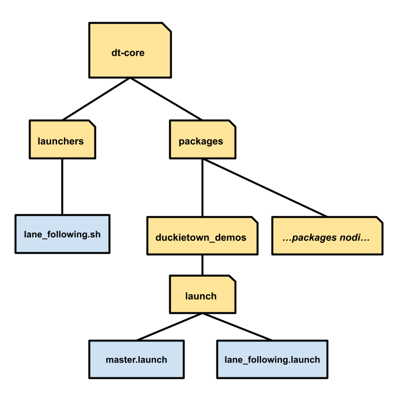
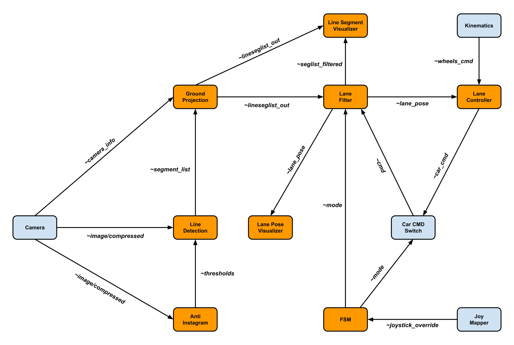

# Personalizzare il Lane Following in Duckietown

La presente guida ha l'obiettivo di descrivere come personalizzare la funzionalità di ***lane following*** in Duckietown. Dopo aver illustrato la struttura dello stack software della funzionalità in questione, verranno descritti i passaggi da seguire per apportare modifiche al codice ed eseguire la demo così modificata. 

## Struttura del Codice 

Il software impiegato da Duckietown nei suoi duckiebot è basato sull'uso di Docker. Il codice di Duckietown è dunque costituito da container (e immagini corrispondenti) organizzati nella gerarchia sopra riportata.
Il codice che va a costituire lo stack software della funzionalità (nonché demo) *lane following* è contenuto nella immagine `dt-core`, la quale contiene tutte le funzionalità di alto livello del duckiebot. Questa immagine usa come base `dt-ros-commons`, alla base di altre importanti immagini quali `dt-duckiebot-interface` (contenente i driver per l'hardware) e `dt-car-interface` (contenente tutto il necessario per guidare il duckiebot).
Il codice sorgente di `dt-core` può essere agevolmente studiato su **GitHub**, partendo da [qui](https://github.com/duckietown/dt-core). Come accennato in precedenza, il *lane following* non è l'unica funzionalità implementata da `dt-core`. Per poter attivare il *lane following* è necessario eseguire il comando

    dts duckiebot demo --demo_name lane_following --duckiebot_name <DUCKIEBOT_NAME> --package_name duckietown_demos

come illustrato in [questa pagina](https://docs.duckietown.org/daffy/opmanual_duckiebot/out/demo_lane_following.html) della documentazione ufficiale. Questo comando è però un "wrapper",  la cui chiamata avvia la demo in base ai seguenti passaggi:

 1. Attraverso l'uso di *[lane_following.sh](https://github.com/duckietown/dt-core/blob/daffy/launchers/lane_following.sh)* viene eseguito il comando `dt-exec roslaunch --wait duckietown_demos lane_following.launch`.
 2. Nel file *[lane_following.launch](https://github.com/duckietown/dt-core/blob/daffy/packages/duckietown_demos/launch/lane_following.launch)* vengono specificati i nodi ROS facenti parte dello stack software, ma viene anche chiamato *[master.launch](https://github.com/duckietown/dt-core/blob/daffy/packages/duckietown_demos/launch/master.launch#L129)* specificando il "lane following".
 3. Il file *master.launch*, con l’input “lane following”, si occupa di effettuare il *remapping* di tutti i topic ROS interessati e di includere nello stack software tutti nodi che compongono il *lane following*, anche quelli che non si trovano in *lane_following.launch*.
 4. Per effetto di *master.launch*, vengono chiamati i file di lancio di tutti i nodi che compongono lo stack software, ciascuno memorizzato nel package del nodo corrispondente.

Nell'immagine seguente è mostrato come sono disposti i file sopracitati in `dt-core`.

I nodi che compongono lo stack software sono memorizzati in appositi package, i quali si trovano nella directory ["packages"](https://github.com/duckietown/dt-core/tree/daffy/packages) di `dt-core`. I package principali sono i seguenti: 

 - **[Line Detector:](https://github.com/duckietown/dt-core/tree/daffy/packages/line_detector)** Il nodo *[LineDetectorNode](https://github.com/duckietown/dt-core/blob/daffy/packages/line_detector/src/line_detector_node.py)* effettua una correzione del colore e ritaglia l'immagine ricevuta dalla videocamera, crea una copia BGR dell'immagine, converte l'immagine nel modello [HSV](https://it.wikipedia.org/wiki/Hue_Saturation_Brightness) e poi applica l'[algoritmo di Canny](https://it.wikipedia.org/wiki/Algoritmo_di_Canny); infine va ad estrarre i segmenti di linea dall'immagine basandosi su un range di colori e sulla [trasformata di Hough](https://it.wikipedia.org/wiki/Trasformata_di_Hough).
 - **[Ground Projection:](https://github.com/duckietown/dt-core/tree/daffy/packages/ground_projection)** Il nodo *[GroundProjectionNode](https://github.com/duckietown/dt-core/blob/daffy/packages/ground_projection/src/ground_projection_node.py)* va a proiettare i segmenti di linea individuati nell’immagine sia sul piano del terreno che nel sistema di riferimento del robot, facendo uso di una [matrice di omografia](https://en.wikipedia.org/wiki/Homography_%28computer_vision%29).
 - **[Lane Filter:](https://github.com/duckietown/dt-core/tree/daffy/packages/lane_filter)** Il nodo *[LaneFilterNode](https://github.com/duckietown/dt-core/blob/daffy/packages/lane_filter/src/lane_filter_node.py)* crea un filtro (del tipo *["histogram grid filter"](https://calvinfeng.gitbook.io/probabilistic-robotics/basics/nonparametric-filters/01-histogram-filter)*) il quale, ricevendo in input i segmenti calcolati da *LineDetectorNode*, restituisce una stima della posa del robot, ovvero la coppia formata da deviazione laterale e angolare dal centro della carreggiata.
 - **[Lane Control:](https://github.com/duckietown/dt-core/tree/daffy/packages/lane_control)** Il nodo *[LaneControllerNode](https://github.com/duckietown/dt-core/blob/daffy/packages/lane_control/src/lane_controller_node.py)* calcola i comandi di controllo attraverso un controllore PI con tecnologia "anti-reset windup", il quale riceve in input l'errore nella posa relativa del robot e restituisce in output i comandi in termini di velocità lineare e velocità angolare.

Fanno però parte dello stack software anche i seguenti package:

 - **[Anti Instagram:](https://github.com/duckietown/dt-core/tree/daffy/packages/anti_instagram)** Il nodo *[AntiInstagramNode](https://github.com/duckietown/dt-core/blob/daffy/packages/anti_instagram/src/anti_instagram_node.py)* fa uso di funzionalità di *[AntiInstagram](https://github.com/duckietown/dt-core/blob/daffy/packages/complete_image_pipeline/include/image_processing/anti_instagram.py)*, contenuto nel package *Complete Image Pipeline*, per aiutare il nodo *LineDetectionNode* nell'esecuzione dei suoi compiti.
 - **[Complete Image Pipeline:](https://github.com/duckietown/dt-core/tree/daffy/packages/complete_image_pipeline)** Contiene numerose funzionalità, come quelle dell'*AntiInstagram* sopracitato oppure la funzionalità di calibrazione estrinseca, che genera la matrice di omografia impiegata da *GroundProjectionNode*. 
 - **[FSM:](https://github.com/duckietown/dt-core/tree/daffy/packages/fsm)** Il nodo *[FSMNode](https://github.com/duckietown/dt-core/blob/daffy/packages/fsm/src/fsm_node.py)* realizza una macchina a stati finiti. 
 - **[Visualization Tools:](https://github.com/duckietown/dt-core/tree/daffy/packages/visualization_tools)** Fornisce strumenti di visualizzazione quali i nodi *[LanePoseVisualizer](https://github.com/duckietown/dt-core/blob/daffy/packages/visualization_tools/src/lane_pose_visualizer_node.py)* e *[LineSegmentVisualizer](https://github.com/duckietown/dt-core/blob/daffy/packages/visualization_tools/src/line_segment_visualizer_node.py)*.

Nella immagine seguente viene mostrato come i nodi facenti parte lo stack software del *lane following* (in arancione) interagiscono (attraverso i topic ROS) con gli altri nodi attivi nel duckiebot (in azzurro).

## Modificare lo Stack Software
Poniamo ora come obiettivo quello di descrivere una procedura per apportare modifiche allo stack software della demo *lane following*. L'idea di base è quella di modificare uno o più package che compongono la pipeline della demo e poi integrare i package modificati nello stack software, così da poter avviare la demo modificata con lo stesso comando impiegato per avviare la demo "originale". Di seguito si suppone di lavorare con un duckiebot di tipo DB18: l'architettura di base è dunque *arm32v7*, e il codice sorgente appartiene al ramo *daffy* (quello implicitamente considerato in precedenza).

### Avviare la Demo
Già in precedenza è stato illustrato che per poter avviare la demo *lane following* è necessario eseguire il comando

    dts duckiebot demo --demo_name lane_following --duckiebot_name <DUCKIEBOT_NAME> --package_name duckietown_demos

che si rivela essere un "wrapper" per il comando 

    roslaunch duckietown_demos lane_following.launch veh:=<DUCKIEBOT_NAME> robot_type:=duckiebot robot_configuration:=DB18

Prima di avviare la demo è necessario assicurarsi che i container `dt-duckiebot-interface` e `dt-car-interface` siano in esecuzione; questo può essere fatto da terminale o attraverso Portainer. Fatto questo, è possibile eseguire il comando mostrato sopra: se la demo non è mai stata eseguita, questo porterà il duckiebot a scaricare l'immagine `duckietown/dt-core:daffy-arm32v7`. Questa non solo è l'immagine della demo "standard" del *lane following*, ma è anche l'immagine utilizzata come base per la nostra versione modificata.

### Personalizzare la Demo
Per poter operare sullo stack software è necessario non solo l'interfaccia a riga di comando del proprio PC, ma anche di quella del proprio duckiebot. Quest'ultima può essere acceduta attraverso SSH con il comando

    ssh duckie@<DUCKIEBOT_NAME>.local

eseguito dal proprio PC; è normalmente richiesta una password - di default *quackquack*.

Si può ora procedere con il modificare la demo *lane following* attraverso i passaggi seguenti:

 1. All'interno del duckiebot, ri-taggare l'immagine `duckietown/dt-core:daffy-arm32v7` con il comando `docker tag duckietown/dt-core:daffy-arm32v7 duckietown/dt-core:backup` ed eliminare il vecchio tag con il comando `docker rmi duckietown/dt-core:daffy-arm32v7`.
 2. All'interno del proprio PC, clonare la directory `dt-core` da GitHub con il comando `git clone https://github.com/duckietown/dt-core` (di default nel ramo *daffy*).
 3. Copiare dalla directory `dt-core/packages/` i package che si intende modificare e apportare le modifiche desiderate.
 4. Spostare tutti i package modificati in una cartella <pkgs_dir>. Si sconsiglia di utilizzare il nome "packages", poiché potrebbe creare conflitti.
 5. Copiare nel duckiebot la cartella <pkgs_dir> utilizzando il comando `scp -r <pkgs_dir>/ duckie@lugia.local:/home/duckie`. Si suppone di essere nella directory in cui si trova <pkgs_dir>, altrimenti sarà necessario specificare il percorso (relativo o assoluto).
 6. Creare un Dockerfile come segue:

    `FROM duckietown/dt-core:backup`
   `WORKDIR ${CATKIN_WS_DIR}/src/dt-core`
  `ARG PACKAGES`
   `COPY ./${PACKAGES} ./${PACKAGES}`
   `RUN \cp -rf ./${PACKAGES}/* ./packages`
   `RUN rm -r ./${PACKAGES}`

 7. Supponendo di aver creato il Dockerfile nel proprio PC, copiare nel duckiebot il Dockerfile utilizzando il comando `scp Dockerfile duckie@lugia.local:/home/duckie`. Si suppone di essere nella directory in cui si trova tale file, altrimenti sarà necessario specificare il percorso (relativo o assoluto).
 8. Nel duckiebot, spostarsi nella directory in cui sono memorizzati <pkgs_dir> e il Dockerfile; come risultato dei comandi precedenti la directory è `/home/duckie`.
 9. Eseguire il comando `docker build -t duckietown/dt-core:daffy-arm32v7 --build-arg PACKAGES=<pkgs_dir> .` nel duckiebot.

Una volta terminati questi passi, si potrà avviare la demo come di norma con il comando

    dts duckiebot demo --demo_name lane_following --duckiebot_name <DUCKIEBOT_NAME> --package_name duckietown_demos

Il comando avvierà la versione modificata del *lane following*, basandosi essa sulla *nostra* versione dell'immagine `duckietown/dt-core:daffy-arm32v7`.
